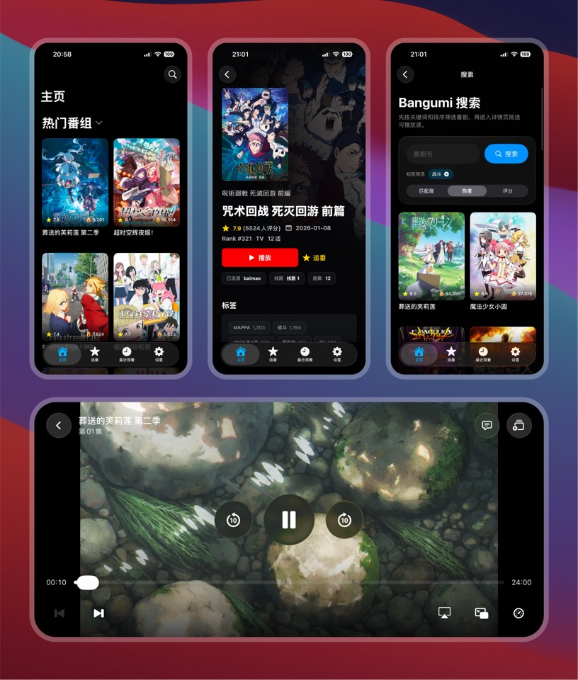
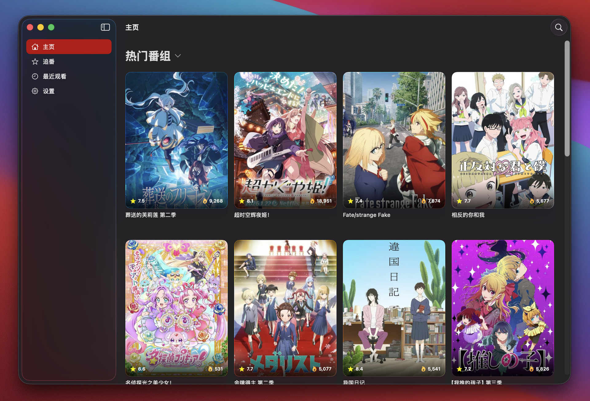
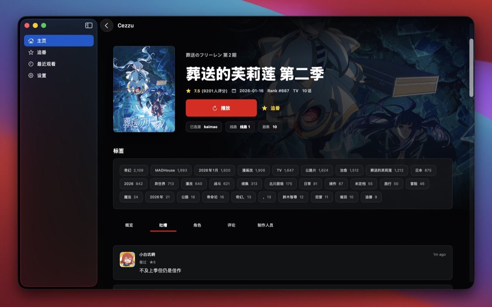

<p align="center">
  <picture>
    <source media="(prefers-color-scheme: dark)" srcset="docs/icon-dark.png">
    
  </picture>
</p>

<h1 align="center">Cezzu</h1>

<p align="center">
  <a href="./README.md">中文</a> ・ <strong>English</strong>
</p>

> A native iOS / macOS **third-party video player** — inspired by the design direction of the open-source project [Kazumi](https://github.com/Predidit/Kazumi) and independently implemented on top of Apple's native stack (Swift + SwiftUI + Liquid Glass), while reusing its open-source rule protocol. Rule content itself is maintained separately in the sibling [`cezzu-rule`](./cezzu-rule/) repository; the app ships no content of its own.

> [!CAUTION]
> This is a fully open-source, non-profit learning project — the code is entirely public, there are no paid features, and no donations or commercial licensing are offered. For study purposes only — please support official, licensed content.

Cezzu is a **monorepo** with two sibling sub-projects:

| Sub-project | Role | Entry point |
| --- | --- | --- |
| [`cezzu/`](./cezzu/) | The Swift app itself (`CezzuKit` framework + iOS / macOS App targets) | `cezzu/Cezzu.xcodeproj` (generated by XcodeGen) |
| [`cezzu-rule/`](./cezzu-rule/) | Rule content repository (JSON rules + index + docs); the app pulls from here by default | `cezzu-rule/README.md` |

## What it does

A native iPhone / iPad / Mac client that plays third-party video sources. No login, no subscription, no ads.

### Core features

- **Anime search & detail pages**: powered by Bangumi — covers, ratings, popularity, synopsis, tags, episode count and air date.
- **Follow list**: bookmark what you care about, collected in a dedicated tab.
- **Watch history & resume**: remembers the exact episode and timestamp you left on; reopen and you're right back there.
- **Multi-source switching**: multiple upstream video sources are wired in.
- **Danmaku (bullet comments)**: auto-fetched and rendered in sync; font size, opacity, vertical coverage, lifetime and line height are all tunable; scroll / top-pinned / bottom-pinned layers can be toggled independently; optionally tracks playback rate.
- **Playback**: variable speed, long-press temporary boost, Picture-in-Picture, background audio, AirPlay-style cross-device audio.
- **Built-in rule sources**: ships with a curated set of default rules out of the box; additional sources can be subscribed to or imported manually.

### Dedicated iOS / macOS polish

One SwiftUI codebase, but both sides feel genuinely native — not a phone app crammed onto a desktop, and not a desktop window shrunk onto a phone.

- **iPhone**: bottom tab navigation, automatic landscape on the player, PiP, background audio, haptic feedback, edge gestures.
- **iPad**: adaptive large-screen layout with split-view sidebar navigation.
- **Mac**: real window chrome, menu bar, system-driven light/dark mode, keyboard shortcuts, hover states — not a ported iPad binary.
- **Progressive Liquid Glass**: on iOS 26 / macOS 26 the UI uses Apple's real Liquid Glass (dynamic refraction + morphing transitions); older platforms fall back cleanly to `Material` blur — slightly softer visually, fully functional.
- **Single visual language**: cards, buttons, toolbars, player controls and list rows all flow through one glass component family, so surfaces feel consistent across the app instead of stitched together.
- **Dark-mode-first**: tuned for long viewing sessions — cover art carries a bottom gradient overlay with rating and popularity.

## App Preview

### iOS Preview

<p align="center">
  
</p>

### macOS Preview

<p align="center">
  
</p>

<p align="center">
  
</p>

## Quickstart

### Prerequisites

- macOS 15+ with Xcode 26+ (development environment; `Package.swift` requires swift-tools-version 6.2)
- Swift 6.2+
- [XcodeGen](https://github.com/yonaskolb/XcodeGen): `brew install xcodegen`

### Runtime support range

- **iOS 17.0+ / macOS 14.0+**: baseline; full functionality available
- **iOS 26+ / macOS 26+**: real Liquid Glass APIs (`glassEffect`, `GlassEffectContainer`, `.buttonStyle(.glass)`) automatically enabled
- On older platforms, glass effects fall back to SwiftUI `Material` (`.ultraThinMaterial`) — visually slightly weaker but fully functional

### Build & run with Xcode

```bash
# 1. clone the whole monorepo (must include both cezzu/ and cezzu-rule/ siblings)
git clone <repo-url> cezzu && cd cezzu

# 2. generate the Xcode project
cd cezzu && xcodegen generate

# 3. open in Xcode
open Cezzu.xcodeproj
```

Then pick a scheme:

- **Cezzu-iOS** → ⌘R to run the iOS Simulator (iOS 17+ device / simulator; iOS 26+ enables Liquid Glass automatically)
- **Cezzu-macOS** → ⌘R to run macOS native (macOS 14+; macOS 26+ enables Liquid Glass automatically)

Seed rules are automatically synced into the SwiftPM resources by the `Cezzu-iOS` / `Cezzu-macOS` target's `preBuildScripts` (i.e. `cezzu/scripts/sync_seed_rules.sh`) on every Xcode build — **no manual step required**.

### After editing `project.yml`

Any change to `cezzu/project.yml` (adding a target, tweaking a build setting, adding an entitlement, adding a file reference) requires regenerating:

```bash
cd cezzu && xcodegen generate
```

`*.xcodeproj` / `*.xcworkspace` are **not committed to git** — they're generated artifacts, regenerated locally per developer. `project.yml` is the source of truth; edit it instead of touching build settings via the Xcode GUI.

### Run tests without Xcode (the recommended dev loop)

The fastest feedback loop while editing `CezzuKit` internals:

```bash
cd cezzu/CezzuKit
swift test                                    # full run
swift test --filter CezzuRuleDecodingTests    # run a single suite
```

You only need to open Xcode when you actually have to verify UI / on-device playback / WebKit extraction.

### Run macOS app without Xcode

`CezzuKit`'s `Package.swift` also includes a `CezzuMac` executable target, so you can launch the macOS version directly via SwiftPM:

```bash
cd cezzu/CezzuKit
swift run CezzuMac
```

No `.app` bundle, no sandbox — handy for quick non-UI verification. Use the Xcode workflow for production builds.

### Working on a sub-project independently

Want to edit rule content only (without touching Swift code) → just edit `cezzu-rule/rules/*.json`, then run `./cezzu-rule/scripts/update_index.swift` to regenerate `index.json`. See [`cezzu-rule/README.md`](./cezzu-rule/README.md).

## Platform & language

- **iOS 17+ / macOS 14+** (minimum support line; iOS 26+ / macOS 26+ enables Liquid Glass automatically)
- **Swift 6** (swift-tools-version 6.2) with strict concurrency mode
- The only third-party dependency: [Kanna](https://github.com/tid-kijyun/Kanna) (XPath / HTML parsing)

## Design goals

- **Native-first experience**: scrolling, gestures, PIP, background playback, memory footprint and install size are all handled by Apple's native frameworks (SwiftUI / AVFoundation / WebKit) under platform-standard behaviour.
- **Progressively enhanced design language**: a single SwiftUI codebase covers iOS / macOS. iOS 26+ ships real Liquid Glass; older platforms fall back to `Material`. Business code is platform-agnostic. All glass effects flow through `CezzuKit/Views/Design/Glass*.swift`. Hand-rolled fake glass is forbidden.
- **Zero forking in core logic**: core code lives in `CezzuKit`. `#if os(iOS)` / `#if os(macOS)` is forbidden in `CezzuKit`; platform forking is allowed only at App-target entry points. Version forking via `if #available` is allowed only inside `Views/Design/`.

## Acknowledgements

Cezzu stands on the shoulders of a number of open-source projects and public services. Sincere thanks to each of them for making this possible.

- **[Kazumi](https://github.com/Predidit/Kazumi)** — Cezzu's overall design is heavily inspired by Kazumi, and its rule protocol is inherited wholesale. Without the upstream authors paving the way, this project wouldn't exist.
- **[KazumiRules](https://github.com/Predidit/KazumiRules)** — the initial content under `cezzu-rule/rules/` is forked from KazumiRules (MIT License). Thanks to the rule maintainers for their long-running work on site adapters.
- **[DanDanPlay](https://www.dandanplay.com/)** — special thanks to DanDanPlay: Cezzu uses their public API to power the danmaku experience, and we're grateful they've kept this capability freely open to the community for years.
- **[Bangumi](https://bangumi.tv/)** — special thanks to Bangumi: anime metadata (search, subject detail, characters, staff, trending) is sourced from their public API. Reviews and long-form comments are not yet exposed by the official API, so they are fetched by parsing the corresponding public web pages. Backed by years of careful curation from the Bangumi community.

Cezzu is an independent learning project with no affiliation or sponsorship tied to any of the above. If a maintainer of any listed project / service would like the wording adjusted, or would prefer we stop using the relevant API, please open an issue and we'll respond right away.

## Disclaimer

- Cezzu is an open-source **learning project** — a third-party video player for iOS / macOS. It does **not** provide, host, or distribute any video content, danmaku, or anime metadata of its own.
- Playable content comes entirely from third-party sites via rules the user subscribes to or imports. Danmaku is fetched from DanDanPlay's public API. Anime metadata comes primarily from Bangumi's public API; reviews and long-form comments are obtained by parsing Bangumi's public web pages. Cezzu makes no warranty regarding the legality, accuracy, or availability of any of this third-party content.
- Users are responsible for judging whether their own usage complies with local laws and regulations, and bear the corresponding legal responsibility themselves. **Please support the works you enjoy through official / licensed channels whenever possible.**
- If you are a rights holder and believe that Cezzu or any of its default rules infringes upon your rights, please open a GitHub Issue. After verification we will take the corresponding rule / integration down.

## Privacy Policy

Cezzu is a **fully local client app**. There is no "Cezzu cloud" of any kind.

- **No login required**: the app does not require creating or signing in to any account, and does not offer any login feature.
- **No developer backend**: the developer does not operate any server on Cezzu's behalf. All network requests are issued directly from your device to the respective third-party services (Bangumi / DanDanPlay / third-party source sites) — **nothing is routed through a developer-controlled server.**
- **No personal data collection**: the developer does not collect, store, or upload any device information, usage data, watch history, follow list, or search history from you.
- **Local-only storage**: watch history, follow list, playback settings and similar data live only on your device (via SwiftData) and are removed when you uninstall the app. They never leave your device.
- **Third-party requests**: Cezzu does make network requests to Bangumi / DanDanPlay / user-configured source sites on your behalf. Whatever metadata those requests carry (IP, User-Agent, etc.) is governed by each third-party's own privacy policy, not by Cezzu.

In short: what you watch, follow, or search for is known only to your own device.

## License

MIT — see [LICENSE](./LICENSE).
